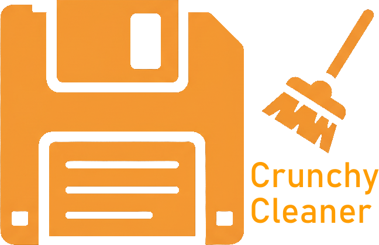
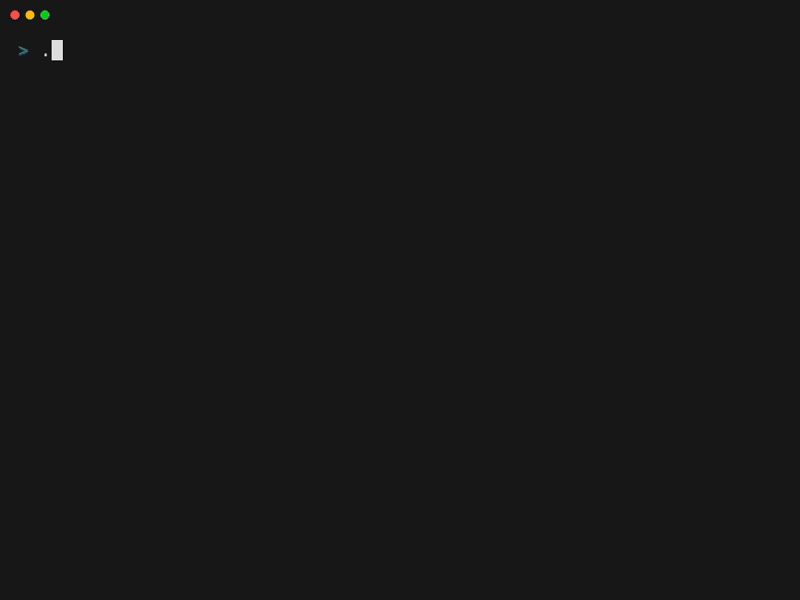

<p align="center">
  
  <a href="https://goreportcard.com/report/github.com/knuspii/crunchycleaner/v2"></a>
  <a href="https://github.com/knuspii/crunchycleaner/actions/workflows/go.yml"></a>
  <a href="https://github.com/knuspii/crunchycleaner/stargazers"></a>
  <br>
  
  
</p>

<div align="center">
<h1>CrunchyCleaner </h1>

</div>

### 🧹 A lightweight, software [cache](https://wikipedia.org/wiki/Cache_(computing)) cleanup tool for Windows & Linux.
> Made by: Knuspii, (M)
- **Cross-Platform:** Works on both **Windows** and **Linux**
- **Lightweight:** Single binary, no dependencies (just download and run it)
- **TUI (Text-UI):** Simple, minimalist interface, no confusing menus

---

### Supported Software List:
| Category | Software / Path |
| :--- | :--- |
| **System** | System Logs, System Temp Folders, Thumbnail Cache, Shader Cache |
| **Browsers** | Firefox, Google Chrome, Microsoft Edge, Brave, Opera |
| **Development** | Visual Studio Code, Slack, JetBrains IDE, Go, Pip, NPM, Yarn, Cargo, NuGet, Gradle |
| **Gaming** | Steam, Epic Games(Heroic) |
| **Apps** | Discord, Spotify, Thunderbird, Telegram |

**Flatpak is supported** \
**Snap is not supported**

---

## 📥 How to Install & Download 
Paste the corresponding command into your terminal and restart it afterwards. \
For Linux (using sudo):
```
curl -L https://github.com/Knuspii/CrunchyCleaner/releases/latest/download/crunchycleaner -o cc && sudo install -m 755 cc /usr/local/bin/crunchycleaner && rm cc
```
For Windows (using Powershell as Admin):
```
$d="$env:ProgramFiles\CrunchyCleaner"; md $d -F; iwr "https://github.com/Knuspii/CrunchyCleaner/releases/latest/download/crunchycleaner.exe" -OutFile "$d\crunchycleaner.exe"; $p=[Environment]::GetEnvironmentVariable('Path',2); if($p -notlike "$d"){[Environment]::SetEnvironmentVariable('Path',"$p;$d",2)}
```
For Go (using go install):
```
go install github.com/knuspii/crunchycleaner/v2@latest
```
After that you can just type `crunchycleaner -v` into your terminal to verify it's installed.

Or download the binary and just run/open it:
[[Download here]](https://github.com/knuspii/crunchycleaner/releases)

---

## Options:
```
  -a    Automate cleaning (select all and start immediately)
  -d    Simulation mode without deleting files (for testing)
  -v    Display version information
```

---

> [!WARNING]
> You use this tool at your own risk!

> [!NOTE]
> AI was used for this project in some parts.

## Q&A
**Q:** Will this break my system? \
**A:** No.\
\
**Q:** What does it actually delete? \
**A:** Only cache files and temp files.\
\
**Q:** Why another cleaner? \
**A:** Because this one is easy, simple, small and lightweight.

## Other Downloads
CrunchyCleaner is also available on SourceForge \
[](https://sourceforge.net/projects/crunchycleaner/files/latest/download)
[](https://sourceforge.net/projects/crunchycleaner/files/latest/download)

### 🎖️ Featured on
[](https://github.com/rothgar/awesome-tuis)
[](https://github.com/avelino/awesome-go)
[](https://github.com/0PandaDEV/awesome-windows)

### External Dependencies
This project uses the following external dependencies:
- **[github.com/eiannone/keyboard](https://github.com/eiannone/keyboard)** – used for cross-platform keyboard input (MIT License)
- **[github.com/shirou/gopsutil](https://github.com/shirou/gopsutil)** – used for cross-platform system and hardware metrics (BSD 3-Clause License)
